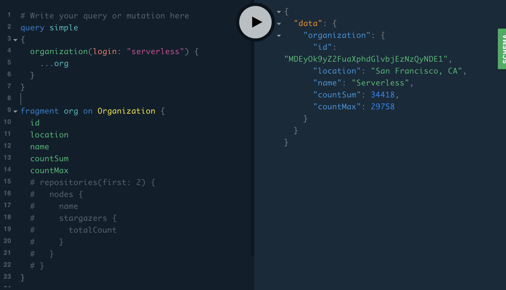

# Customize existing GraphQL API / Add a field

## TL;DR

You can add new fields with schema stitching technique (additional schema and `mergeSchema`).

```js
const addition = gql`
extend type TypeA {
    fieldA: Int
}
`
const schema = mergeSchemas({
    schemas:[original, addition], 
    resolvers: { 
        TypeA: {
            fieldA: {
                resolve: (p, a, c, i) => funcA(p),
                fragment: fragmentRequired // for funcA
            },
        }
    }
});
```

## Concept

GraphQL is excellent API for data publishing and fetching. 
GraphQL's schema is the advantage and makes it very easy to share schema information of published data.

When we use GraphQL more deeply, we can **customize existing GraphQL API and publish it as new GraphQL API** easily.

We utilize **schema stitching technique**, which is provided by de facto tool `graphql-tools`.


## Sample code

This sample code gets Github API v4 as existing GraphQL API. (You must have Github Access Token)

We deploy the sample to AWS. But if you don't have AWS account, offline test is available.

The following is all the source code.
Save it as `graphql.js`.

```js
const { ApolloServer, gql } = require('apollo-server-lambda');
const {makeRemoteExecutableSchema, mergeSchemas, introspectSchema } = require('graphql-tools');
const fetch = require('node-fetch');
const { HttpLink } = require('apollo-link-http');

// (Just a preparation) function for fetching Github schema
const createRemoteSchema = async () => {
	const uri = 'https://api.github.com/graphql';
	const headers = { Authorization: `bearer <GITHUB_ACCESS_TOKEN>`}; // Change to your own Github token
	const link = new HttpLink({uri, fetch, headers});
	return makeRemoteExecutableSchema({
		schema: await introspectSchema(link),
		link
	});
};

// New two functions (A, B) added as fields to a type "Organization" in Github schema.
// NOTE: these functions requires "Organization.repositories.stargazers.totalCount".
// "repos" means repositories, but the name is changed because of a reason to explain later.

// Function A: get stargazer number sum of multiple repositories.
const funcA = (organization) => {
	const array = organization.repos.nodes.map(e => e.stargazers.totalCount)
	return array.reduce((a,b) => a + b)
}

// Function B: get max from stargazer numbers of multiple repositories.
const funcB = (organization) => 
  Math.max.apply(Math, organization.repos.nodes.map(e => e.stargazers.totalCount))

// New schema incluging new fields.
const createNewSchema = async () => {
	// 1. Original Github schema
	const originalSchema = await createRemoteSchema();

	// 2. Schema extension to add new field
	const schemaExtension = gql`
		extend type Organization {
			"countSum: new field for Function A (calculate sum)" # comment for Function A
			countSum: Int # Function A
			"countMax: new field for Function A (get sum)" # comment for Function B
			countMax: Int # Function B
		}
	`;

	// 3. Fragment about which field must be prefetched.
	// IMPORTANT: Function A and B require "Organization.repositories.stargazers.totalCount". 
	// So I must set a new fragment for prefetching required data.
	// Fragment name cannot conflict with existing field name (e.g. "repositories"). 
	// This is why the name "repos" is changed.
	const fragmentRequired = `fragment repos on Organization {
			repos: repositories(first: 20) { # some arg required. 
				nodes {
					stargazers {
						totalCount
					}
				}
		  }
		}`;

	// 4. final schema = 1. original schema + 2. schema extension (with 3. required fragment)
	const finalSchema = mergeSchemas({
		schemas:[originalSchema, schemaExtension], // 1. + 2.
		resolvers: { // resolvers for 2.
			Organization: {
				countSum: { // Function A
					resolve: (parent, args, context, info) => funcA(parent),
					fragment: fragmentRequired // 3.
				},
				countMax: { // Function B
					resolve: (parent, args, context, info) => funcB(parent),
					fragment: fragmentRequired
				}
			}
		}
	});

	return finalSchema
}

// (just a common pattern) start GraphQL server with new schema.
let handler
module.exports.graphqlHandler = async (event,context, callback) => {
    if(handler == null) {
        const server = new ApolloServer({ schema: await createNewSchema() });
		handler = server.createHandler();
	} else {
		console.log("Already initialized")
	}
    
	context.callbackWaitsForEmptyEventLoop = false;
	return new Promise((resolve, reject) => {
			handler(event, context, callback);
	});
}

```

`package.json` is here.
Save it in the same directory with `graphql.js`.

```json
{
  "name": "apollo-lambda-test",
  "version": "1.0.0",
  "main": "index.js",
  "license": "MIT",
  "dependencies": {
    "apollo-link-http": "^1.5.14",
    "apollo-server-lambda": "^2.4.8",
    "graphql": "^14.2.1",
    "node-fetch": "^2.5.0",
    "serverless-offline": "^4.10.0"
  }
}
```

`serverless.yml` is here.

```yml
service: apollo-lambda
provider:
  name: aws
  runtime: nodejs8.10
functions:
  graphql:
    # this is formatted as <FILENAME>.<HANDLER>
    handler: graphql.graphqlHandler
    events:
    - http:
        path: graphql
        method: post
        cors: true
    - http:
        path: graphql
        method: get
        cors: true
plugins:
  - serverless-offline
```

## Run

```sh
yarn install # or npm install
serverless deploy # or serverless offline for offline test
```

## Test

In your browser, access the designated URL in output of last command (access `localhost:3000/graphql` if you chose offline).



Run the following query.

This query includes the fields "countSum" and "countMax", which we added to Github API.

```graphql
query simple
{
  organization(login: "serverless") {
    ...org
  }
}

fragment org on Organization {
  id
  location
  name
  countSum
  countMax
}
```

You will see results for query of countSum and CountMax.

## Deep dive

TBD.

I published a new article about next pattern of GraphQL customization onto dev.to. "Customize existing GraphQL API / Add a field"
https://dev.to/onelittlenightmusic/customize-existing-graphql-api-add-a-field-4npm